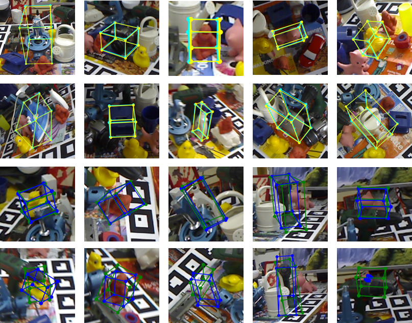

# Estimating 6D Pose From Localizing Designated Surface Keypoints

This is an implementation of our paper Estimating 6D Pose From Localizing Designated Surface Keypoints (https://arxiv.org/abs/1812.01387)" on Python 3.6 and Pytorch 0.4.0. We present an accurate yet effective solution for 6D pose estimation from an RGB image. The core of our approach is to first designate a set of surface points on target object model as keypoints and then train a keypoint detector (KPD) to localize them. A PnP algorithm following can recover the 6D pose according to the 2D-3D relationship of keypoints. Different from recent state-of-the-art CNN-based approaches that rely on atime-consuming post-processing procedure, our method can achieve competitive accuracy without any refinement after pose prediction. Meanwhile, we obtain a 30% relative improvement in terms of ADD accuracy among methods without using refinement. We also succeed in handling heavy occlusion by selecting the most confident keypoints to recover the 6D pose.

Great thanks to @Haoshu Fang!

All the following instructions are based on the assumption that you're in the root directory of Betapose. Please read this README thoroughly before you run the codes to ensure you're clear with what the meaning of the commands and not make mistakes.

## How to train?
### 1. Train yolo. 
Get cfg and weights and change Line 292, 293 of dataloader.py to locate them.  
### 2. Train SOPE (single object pose estimation)
Note every time you run train.py you should change the options/paths correctly. Run train_sppe/src/train.py to train. Check the meaning of options in train_sppe/opt.py.

(1) Train on synthetic data without DPG. Change paths to train/validation dataset on Line 19/21 of train_sppe/src/utils/dataset/coco.py. The number of total training images is over 10000. The training command should look like:

	python3 src/train.py --trainBatch 32 --expID first_step_Nov_1_1 --optMethod adam --momentum 0.9

(2) Train on Linemod dataset to finetune weights without DPG. Again change paths to our preprocessed Linemod train/validation dataset on Line 19/21 of train_sppe/src/utils/dataset/coco.py. The number of total training images is only about 100. Change training command: change expID to a new meaningful name you like and locate model path to the model trained after (1). The training command should look like:

	python3 src/train.py --trainBatch 32 --expID second_step_Nov_1_1 --optMethod adam --momentum 0.9 --loadModel /media/data_1/home/zelin/betapose/exp/coco/first_step_Nov_1_1/model_11.pkl

(3) Train on Linemod dataset with DPG. Keep the paths the same with (2). Change training command: add --addDPG to the training command, change expID to a new meaningful name you like and locate model path to the model trained after (2). For example, 

	python3 src/train.py --trainBatch 32 --expID third_step_Nov_1_1 --optMethod adam --momentum 0.9 --loadModel /media/data_1/home/zelin/betapose/exp/coco/second_step_Nov_1_1/model_8.pkl --addDPG

Note that expID is important to make the whole procedure very clear and it's same with the name of the folder where the trained models locate. Moreover, you should choose the best model (or you can choose the model with bigger index if you're a new_hand) in "--loadModel" every step. For example, in (2) we assume that model_11.pkl is the best one.

## How to run? And what results can I get?

Run run_demo.sh is okay. Read the comments in betapose_evaluate.py to have a better understanding. Mainly all the results are saved in list "final_result" at Line 188. Then we evaluate the results using the rest of the codes.

## Other notifications:

- Type "tensorboard --logdir ./" to see all the train/test figures of all experiments.
	You can specify one experiment dir after "--logdir", of course.
- Folders SPPE and doc are inherited from Alphapose, ignore them temporarily.
- Add "CUDA_VISIBLE_DEVICES=[GPU IDS]" before training command to specify available GPUs. For example,

		CUDA_VISIBLE_DEVICES=1,3 python3 src/train.py --trainBatch 32 --expID line_dpg_001 --optMethod adam --momentum 0.9 --loadModel /media/data_1/home/zelin/betapose/exp/coco/line_nodpg_001/model_8.pkl --addDPG
